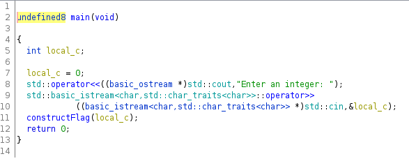
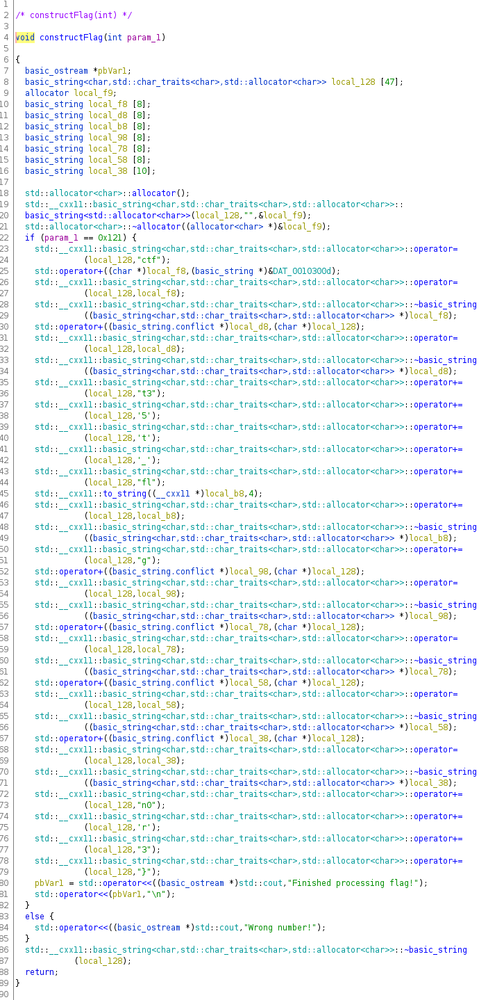
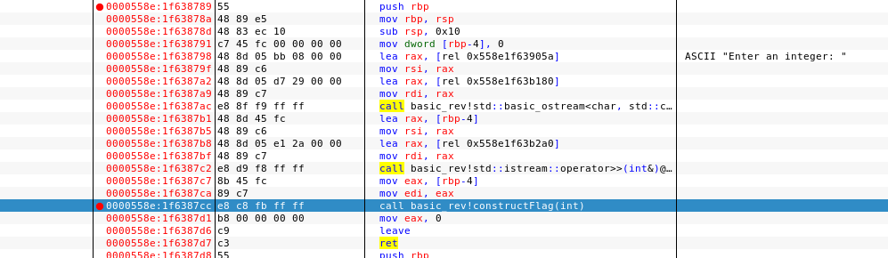
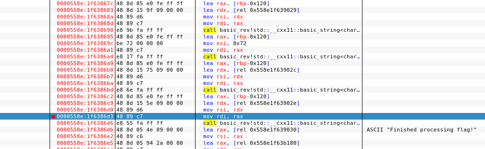
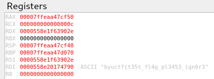

# Basic-Rev Challenge byuCTF-2022
---------------------------------

We are given an executable named "basic_rev". If we execute the program, we are prompted to enter an integer.
We can try some numbers, but the output is always "Wrong number!". Guessing isn't an option, because it would take too long.
So let's fire up Ghidra and look at the code!
After opening the executable in Ghidra and the first analyzing by Ghidra, we can navigate to the functions folder and look at all the function we have.
The first function we should look at is "main":

Here we can see the prompt text. At the end of the function we can see, that another function named "*constructFlag(local_c)*" is called.
So let's have a look at that function:

in line 4 we can see that a parameter is been given by main. This parameter should be equal to our input.
In line 22 is an if statement, which checks our number with *0x121* which is *289* in dezimal.
Let's give this number as an input for our program and see what's happening.
We get the output "*Finished processing flag!*", but we don't get the flag itself. Let's dig deeper in Ghidra.
We will have a second look on the *constructFlag()* function. When the if statement is true, we get some string operations.
In line 24 we see the string "ctf" and in Line 25 we see a Datablock ==DAT_0010300d==
We can navigate to this Data by double-clicking on it. There are now several Datablocks with strings or characters in it.
If we write them down from top to bottom we get something that looks like a flag:
*ctf byu { t3 fl g p l3453 _ ig n0 3 }*
but remember, our flag format looks like this: ==Flag-Format: byuCTF{SOMETHING}==
so the strings seem to be in the wrong order and some characters seem to be missing.
We can run our program in a debugger. I used edb-debugger. We can goto the expression main and make a breakpoint when the *constructFlag()*
function is called.

In the edb-output window we can give our input. We can take one step in after the breakpoint, now we are in the *constructFlag()* function.
We can set another breakpoint right before the string "*Finished processing flag!*" gets written in a register.

That way we have the constructed flag and our program won't close or overwrite the flag.
We let the program run till our breakpoint catches it. In register **RDI** we can see our Flag.

The flag is *byuctf{t35t_fl4g_pl3453_ign0r3}*
